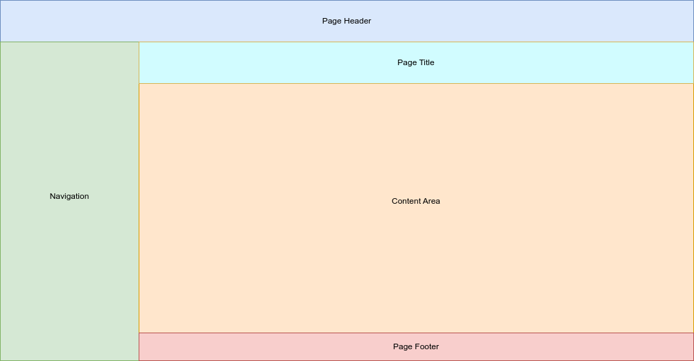
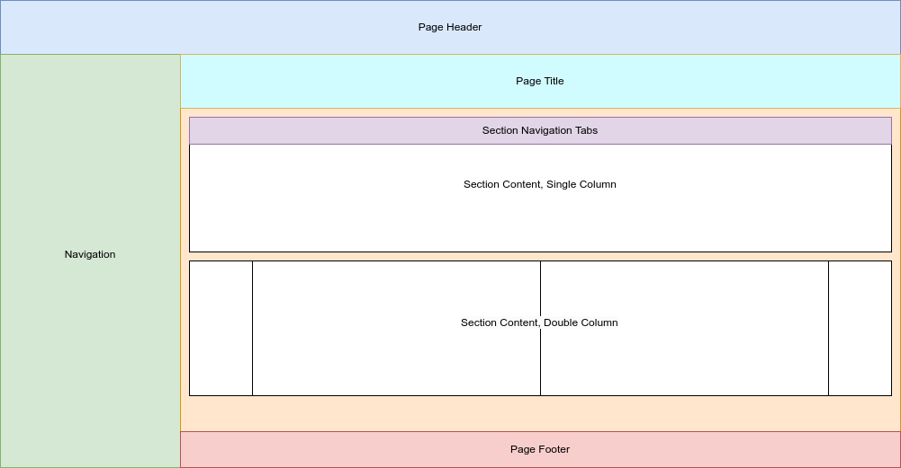

This section of the documentation contains the details related to the templates used within Centurion ERP for rendering data for the end user to view.


## Template Tags

Within Centurion ERP, the following custom template tags exist:

- `choice_ids`

    _if the field is a choice field, you can convert the string value `[ <id>, <id> ]` to a usable list within the template_

- `json`

    _Renders the value in json format_

- `markdown`

    _renders the value as markdown_

- `settings_value`

    _fetches a value from `app/settings.py`_


## Templates

- Base

- Detail


### Base

The base template is common to all templates and is responsible for the rendering of the common layout. Each subsequent template includes this template. This enables **ALL** pages within the site to share the same layout.



Point of note is that the orange area of the template is what each template is "filling out."

This view contains the following areas:

- Page Header

    _Site header._

- Navigation

    _Site navigation._

- Page Title

    _represents the "what" to the contents of the page. i.e. for a device this would be the device name._

- Content Area

    _The views content_

- Page footer

    _Site footer_

!!! note
    This template should not be included directly as it is incomplete and requires subsequent templates to populate the contents of the orange area.


### Detail

This template is intended to be used to render the details of a single model. The layout of the detail view is as follows:



This view contains the following areas:

- Section navigation tabs
- Section Content

A detail page contains navigation tabs to aid in displaying multiple facets of an item, with each "tabbed" page containing one or more sections. Point of note is that the tabs are only rendered within the top section of each "tabbed" page.

Base definition for defining a detail page is as follows:

``` jinja









    your tabs content here



```

!!! tip
    Need to navigate directly to a tab, add `tab=<slug>` to the url query string


#### Providing data for the view

For the view to render the page, you must define the data as part of the form class.


 The variable name to use is `tabs` The layout/schema is as follows:


##### Full Example

This example is a full example with two tabs: `details` and `rendered_config`

``` python

tabs: dict = {
    "details": {
        "name": "Details",
        "slug": "details",
        "sections": [
            {
                "layout": "double",
                "left": [
                    'name',
                    'config_key_variable',
                    'template',
                    'organization',
                    'c_created',
                    'c_modified'
                ],
                "right": [
                    'model_notes',
                ]
            }
        ]
    },
    "rendered_config": {
        "name": "Rendered Config",
        "slug": "rendered_config",
        "sections": [
            {
                "layout": "single",
                "fields": [
                    'config_variables',
                ],
                "json": [
                    'config_variables'
                ]
            }
        ]
    }
}

```

additional fields can be defined as part of the form `__init__` method.

``` python

def __init__(self, *args, **kwargs):

    super().__init__(*args, **kwargs)

    self.fields['config_variables'] = forms.fields.JSONField(
        widget = forms.Textarea(
            attrs = {
                "cols": "80",
                "rows": "100"
            }
        ),
        label = 'Rendered Configuration',
        initial = self.instance.config_variables,
    )

    self.fields['c_created'] = forms.DateTimeField(
        label = 'Created',
        input_formats=settings.DATETIME_FORMAT,
        disabled = True,
        initial = self.instance.created,
    )

    self.fields['c_modified'] = forms.DateTimeField(
        label = 'Modified',
        input_formats=settings.DATETIME_FORMAT,
        disabled = True,
        initial = self.instance.modified,
    )

```

You can add an edit button to any tab by defining the following as part of the `__init__` method:

``` py

self.tabs['details'].update({
    "edit_url": reverse('ITIM:_service_change', args=(self.instance.pk,))
})

```

in this example, the details tab will display an `Edit` button. The `Edit` button will only display at the end of the first section of any tab it has been defined for.
