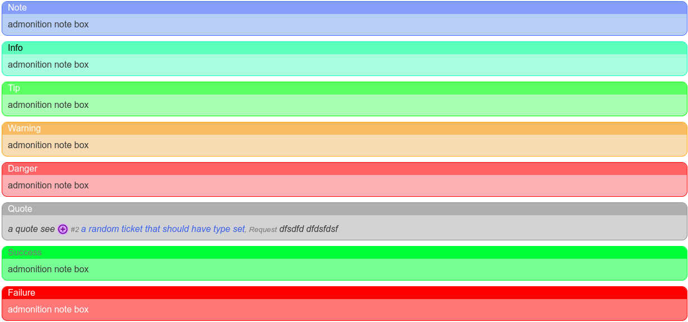

All Text fields, that is those that are multi-lined support markdown text.


## Features

- CommonMark Markdown

- Tables

- Strikethrough

- Code highlighting

- Admonitions

- Linkify

- Task Lists

- Heading Anchors

- Ticket References

- Model References


## Admonitions




declare with:

``` md

!!! <type> "<optional heading in double quotes>"
    text goes here

```

Available admonition types are:

- note

- info

- tip

- warning

- danger

- quote


## Ticket References

Declare a ticket reference in format `#<ticket number>`, and it will be rendered as a link to the ticket. i.e. `#2`


## Model Reference

A Model link is a reference to an item within the database. Supported model link items are:

- cluster

- config_group

- device

- kb

- operating_system

- organization

- service

- software

- team

To declare a model link use syntax `$<type>-<model id>`. i.e. for device 1, it would be `$device-1`
